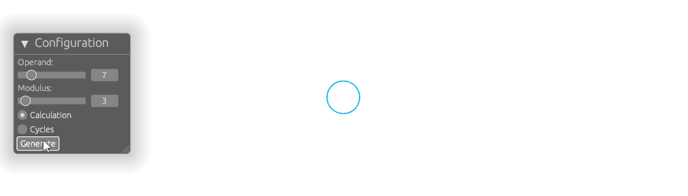
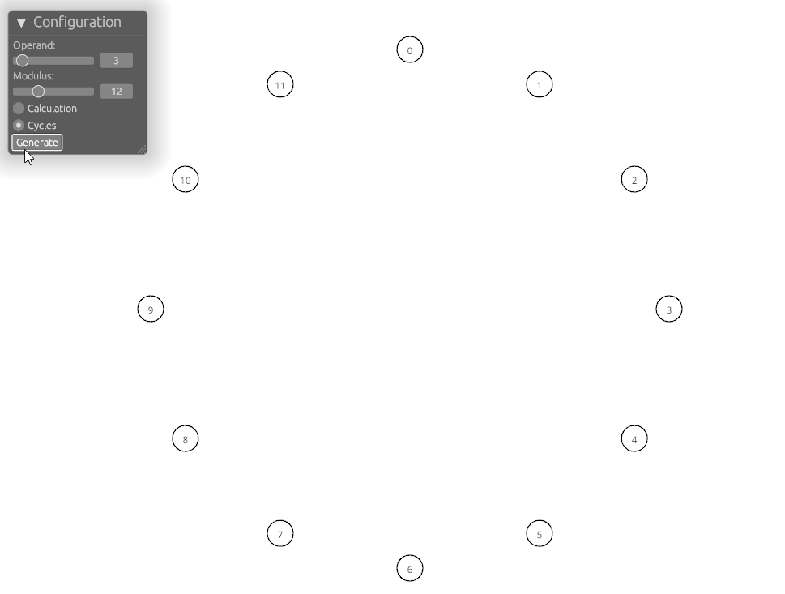

# Modular Arithmetic Visualizer

## Description

The Modular Arithmetic Visualizer is a project using the nannou creative coding framework to explore and visualize modular arithmetic concepts. This tool provides an interactive way to understand the modulo operation and cycles through mathematical visualizations.

## Authorship

Name: Jason Gonzales

Date: February 4, 2025

## Usage

### Modulo Calculation


The example animation shows how the modulo operation maps numbers to their corresponding values within the modulo set. It visually demonstrates the process of computing `a % b`, showing how any natural number $a$ is reduced to fit within the set $\{0, 1, ..., b-1\}$. For example, in `7 % 3 == 1`, the number $7$ is reduced down to $1$, which is highlighted in this modulo system.

### Cycle Visualization


Cycles can be seen by using a number to generate a subset of numbers from a modulo. For example, using $1$ as a generator will generate all other numbers in the modulo. Using $2$ as a generator will either generate all the numbers if the modulus is odd or a subset if it is even. This example animation demonstrates how adding a constant to numbers within a modulo system produces these cycles. In this case we use `mod 12` and visualize adding $3$ to develop our cycles. 

## Installation

Clone the repository and navigate into the project directory:

```sh
git clone https://github.com/jasonandmonte/modular-arithmetic-visualizer.git
cd modular-arithmetic-visualizer
```

## Execution

To compile the program:
```sh
cargo build
```

Run the following command to start the application:

```sh
cargo run
```

## Development Notes

### Successes (What Worked)
Over the course of the project I was able to learn nannou through its documentation and by playing with examples from the GitHub repository. I had started this process during the project proposal phase to ensure I had an idea of what I would be able to create during the time left in the term. Having this project proposal as a roadmap in turn was a great benefit as it allowed me to iteratively build on the project with discrete milestones.

Showing properties of modulo was an interesting challenge that gave me an opportunity to explore features in Rust while building up a codebase. In the end I was able to complete the two distinctive animations of modulo. The first displays how a natural number is mapped to its remainder when divided by the modulus. The second shows a visualization of the cycles that exist in a given modulo from adding a consistent natural number.

### Challenges (What Didn't Work)
Originally I did not have a complete idea for how to manage the animations and spent a lot of time troubleshooting and determining how to restrict shapes from being drawn all at once. The final iteration of this came after added the UI to the application and needing to redraw elements only after the "Generate" button is pressed. This caused earlier versions that used `app.time` to be rewritten in favor of a custom time keeper tied to the Model.

In general I had trouble understanding what was available for `nannou_egui`. I couldn't find much information on how to create an interface in the context of a nannou application. Instead I primarily had to use the examples in nannou's GitHub repository and experiment to achieve what I needed for this project. In the process of implementing a UI I needed to scrap the command line arguments as all changes would be interactively done while the application window was open.

I struggled finding a way to test functions involving structures from nannou such as Draw and Model. I attempted to make instances within the testing section, but I also couldn't find a way to mock their types or egui. Instead I opted to try to reduce draw functions to segment interactions with these structures and extract out auxiliary operations that could be tested. Then I performed manual testing to review the animations produced by adjusting the operand then the modulus.

### Lessons Learned

Going into this project with very little experience in animation or graphics, I had to learn how to work with nannou and understand how shapes were drawn and animations occurred over time. For both of these I found the documentation to be a good first step. In particular the [Anatomy of a Nannou App](https://guide.nannou.cc/tutorials/basics/anatomy-of-a-nannou-app) and [Animating a Circle](https://guide.nannou.cc/tutorials/draw/animating-a-circle) were of great help. Beyond this experimenting with the examples in the [GitHub repository](https://github.com/nannou-org/nannou/tree/master/examples) helped me understand what was possible.

I also enjoyed learning about `clap` for argument parsing. Unfortunately it didn't make the final cut of the project, but I am looking forward to using this crate again in other projects that will primarily be on the command line.

Overall I enjoyed working on this project and I am happy with the progress I made.
